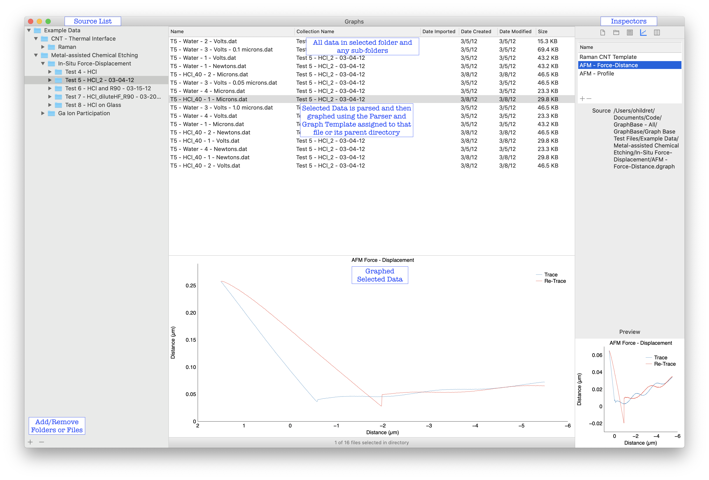
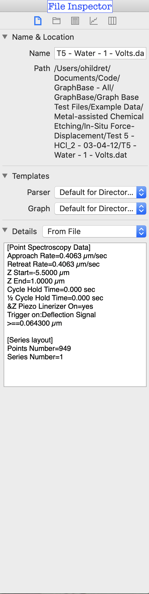
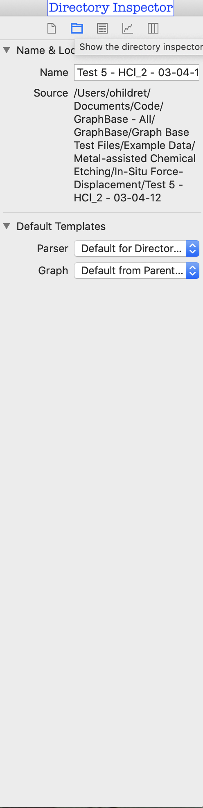
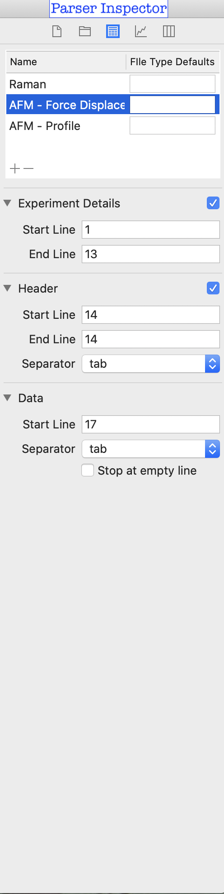
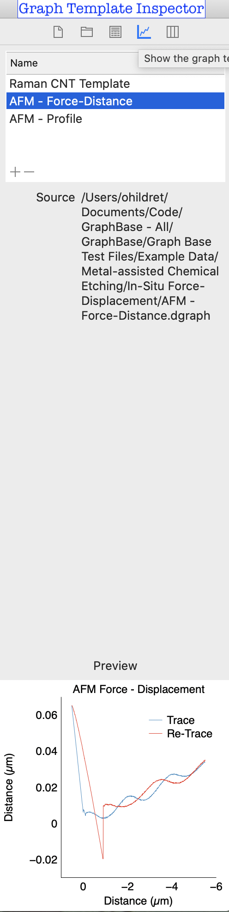
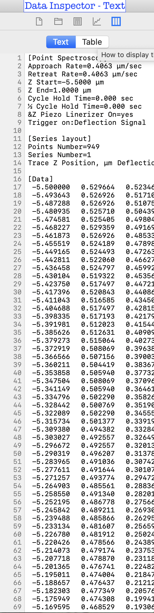
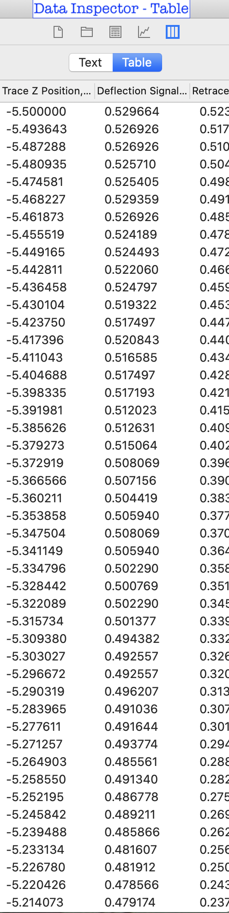

# Graphs
A macOS app that manages the organization of data files and graphs them.

Licensed under the MIT licensing terms: https://opensource.org/licenses/MIT

Hildreth wrote the precursor to Graphs, then called GraphBase, during his Ph.D. to help manage the data he was collecting as part of his research on Metal-assisted Chemical Etching of Silicon.  He was becoming overwhelmed by the hundreds of data files he was collecting every week and was inspired by the Papers and iTunes applications on OS X (now macOS) to create an application that managed data.  GraphBase provided an easy template to create a parser, a simple UI to organize data into hiarchical folders, and leveraged the DataGraph framework (http://www.visualdatatools.com/DataGraph/Framework/) for graphing.  DataGraph (http://www.visualdatatools.com/DataGraph/) is an amazing 2D graphing application and you will need to purchase a DataGraph license from Visual Data Tools in order to use Graphs.

Graphs is a rewrite of GraphBase in Swift written by Connor and then re-written again by Hildreth that has been open sourced for use by all.  Please not that you will need a DataGraph license to create the graph templates used by the DataGraph framework underlying Graphs.  Hildreth plans to continue evolving this application.  The next plan improvements are: multithreading for import and parsing using the new Results type in Swift; and begin switching over to SwiftUI for the UI.  Long term, we hope to add support for data analysis and extraction.

# Overview
Graphs is a data management tool that allows you to store your raw data files in a text formate (CSV, tab delimited, etc.) and then have those files parsed and graphed when selected.  Graphs uses the DataGraph fromework 

To use Graphs, first you create an example graph, what we call a Graph Template, in DataGraph.  Format the graph the way you want it to look and make sure that the Data Columns are in the same order as the columns in your data.  Next, you  add your "Graph Template" to Graphs using either the Graph Template Inspector on the right side of Graphs using using the "+" sign on the bottom left of the application.  You can also drag-and-drop the file onto a folder in the Source List.  Once you add a Graph Template, you can assign it to be the default Graph Template for a folder and any sub-folders using the Folder Inspector.

The second step is to make a Paser using the Parser Inspector.  It might be helpful to have an example file already in Graphs (see Step 3) because you can use the Text Inspector to see what lines your Experimental Details, Header, and Data start at.  Add a Parse Template using the + sign in the Parse Inspector's table and give the Parse Template a name.  If your data has experimental details at the top, then select the checkbox and set the starting and ending lines for this information.  If your data has a Header, select the Header checkbox, give it starting and ending line numbers, and then select the type of separator your file uses to deliniate columns.  This header will be used to overwrite the columns in your Graph Template.  Lastly set the starting line of your data and the separator type.  You can select to have the Data stop at an empty line in case there is extra, non-data, at the end of your data.  Just like the Graph Template, you can use the Folder Inspector to set this Parser as the default parser for a specific folder and its sub-folders.

The third step is to add some data.  The data must be a text file (such as .csv or txt, etc).  You can add one file at a time or entire directories with sub-folders using either the "+" sign in the bottom right or drag-and-drop the file/folder into the Source List on the left.  The files and any sub-folders will imported as references into Graphs and located within the folder selected in the Source List.  At this time, files will inheret the default Graph Template and Parser of the folder they were imported into.

At anytime, you can change the default Graph Template and Parser for a Folder, selection of multiple folders, file, or selection of files using the Folder and File Inspectors.

Now that you've got Graph Templates, Parsers, and Data, you are ready to go.  Simply navigate to your data using the Source List, select the data you are intersted in viewing from the Tableview in the middle and look at your data using the Graph View in the middle.  The selected data is parsed using the Parse Template and then graphed using the Graph Template and the DataGraph Framework.  This parsed and graphed file is cached under Application Support/Graphs to improve load times.  Any changes you make to the Graph Template using DataGraph will be reflected next time select a data item that uses that graph template.  The same is true for the Parser.  As a result, you can evolve your graphs as needed without having to get it perfect the first time.

